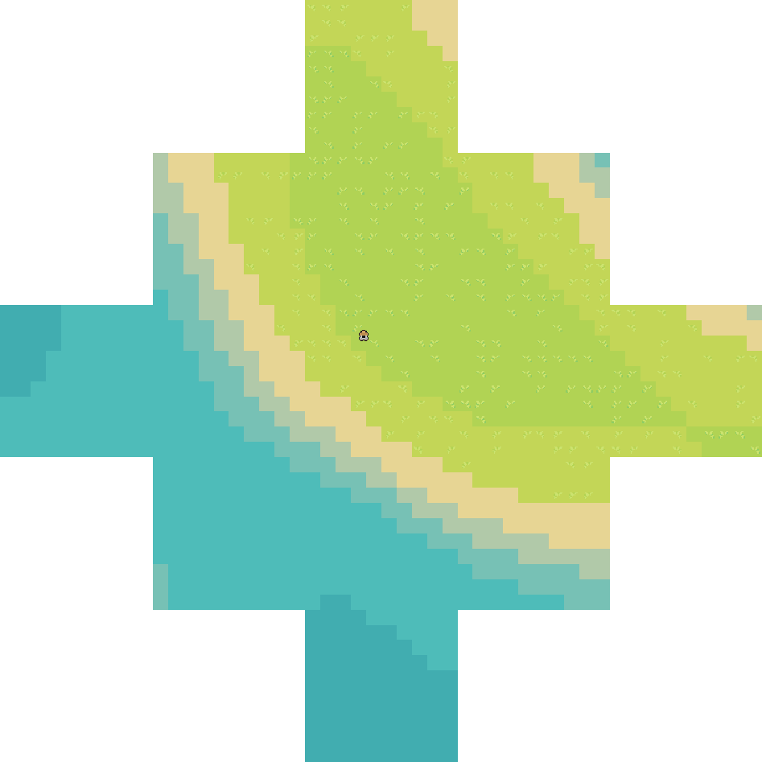

# InfiniteWorld
> This repo shows how to create a infinite chunk based world. 
> The chunks are being created in a layer like way

This is a flexible, easy-to-expand infinite grid based world generation system.
It can be used in any 2d gam

## Features
This project provides a chunk based, infinite world system. 
The chunk generation uses layers, to split the world in different generation tasks. 
This allows level of detail to exist, 
which will improve the ram usage. 

A example of this would be a height map which gets updated the closed the player 
gets, therefore increasing the quality of the map. 
With layers, these quality improvements can get jobbed and done step by step, 
reducing lag.

## Layer types
> A layer can contain data or modify already existing one

### The data layer
This layer type is supposed to create the base data, 
that will later be used to render the terrain. 
For example, a height map layer creates the noise map, for terrain generation

### The data adapter
This layer changes the provided base layer. 
The HeightDataAdapter as example just multiplies the noise value based 
on a animation curve, to raise / lower the terrain and normalizes it,
for better tile placement

## Generation structure
> A infinite world contains chunks at a certain position. 
> Each chunk holds already generated data
### World
This class handles the chunk creation. 
For different lod requests, is the requester responsible. 
It only keeps track of the loaded chunks and the generation

### Player
The player is responsible for requesting the chunks, 
disposing them when the player isn't in distance of 
them and handling the different level of detail

## Examples
> This is the generation when using the default settings

